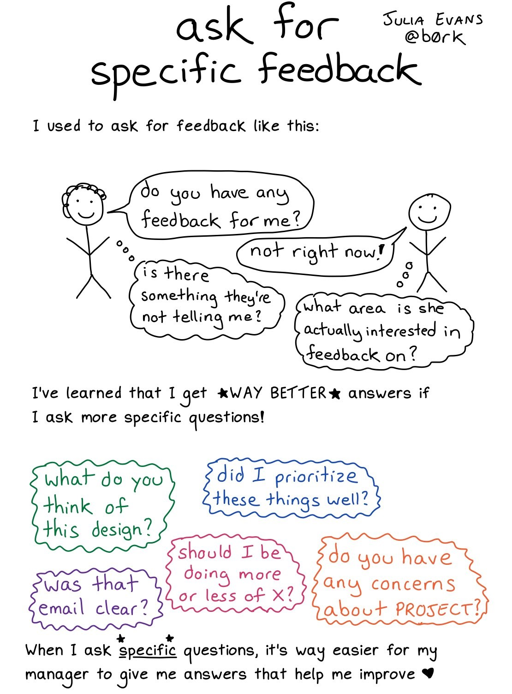

---
header:
  caption: ""
  image: ""
layout: docs
title: Teaching
lastmod: "2020-03-25T00:00:00Z"
linktitle: 
menu:
  courses:
    name: 
    weight: 1
summary: Teaching experience
title: Teaching Portfolio
toc: false
type: docs
weight: 1
---

**Teaching Statement**

TBC

> “Ideal teachers are those who use themselves as bridges over which they invite their students to cross; then, having facilitated their crossing, joyfully collapse, encouraging them to create their own.” 
> 
 Nikos Kazantzakis 

---

*Source:* [Julia Evans](https://twitter.com/b0rk)

{}
Do you want to offer **anonymous feedback** for my teaching? Please use [this form](https://www.emailmeform.com/builder/form/xLl00rwS06o7a) to make anonymous complaints, comments or suggestions.
{}

