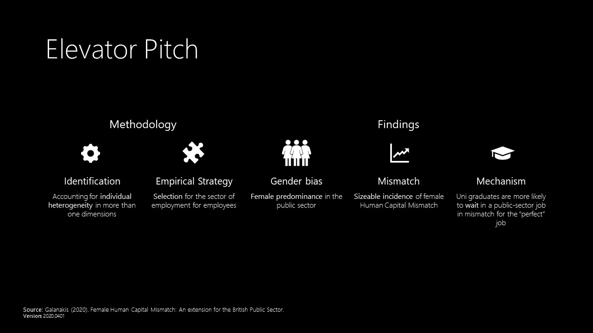

## Abstract

This paper looks at the extent of labour market mismatch of public-sector female employees. It extends earlier findings for the British labour market taking into account the endogenous self-selection into jobs. Estimates are based on data from the British Household Panel Study and the ‘Understanding Society’ covering the years 1991-2016. The public sector offers a few low-skilled jobs and employs mostly high-educated (female) workers. Regarding the market flows, private-sector female labour force faces a lower probability towards retirement, but a higher one regarding unemployment relative to their public-sector colleagues. Once comparing women to the median employee, a sizeable incidence of mismatch arises alongside with a noticeable difference after the crisis. Specifications using the selection model for the public sector illustrate a higher magnitude of mismatch. Pooled results seem to dominate when women seen in the male labour market or in a restricted subsample. Finally, the map of occupations in mismatch supports that the public sector is more attractive as a waiting room to a matched position for highly-qualified graduates, since they queue less time.

